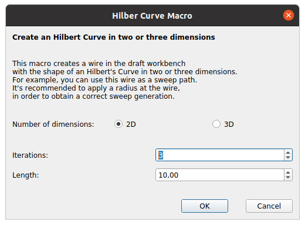
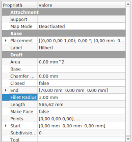
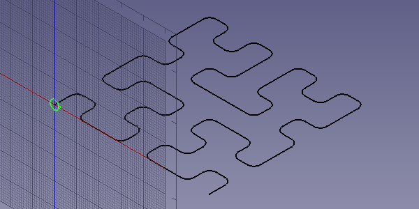
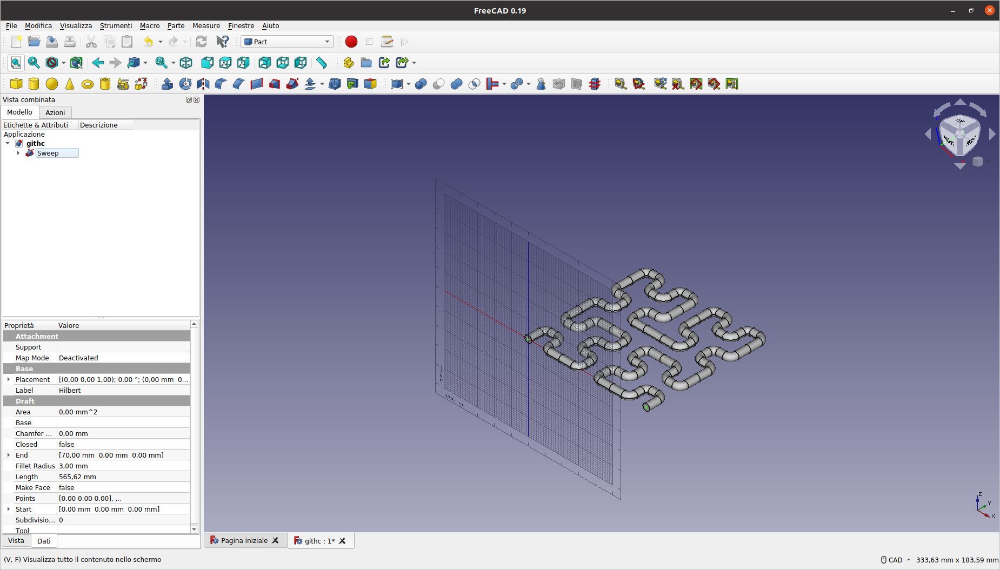
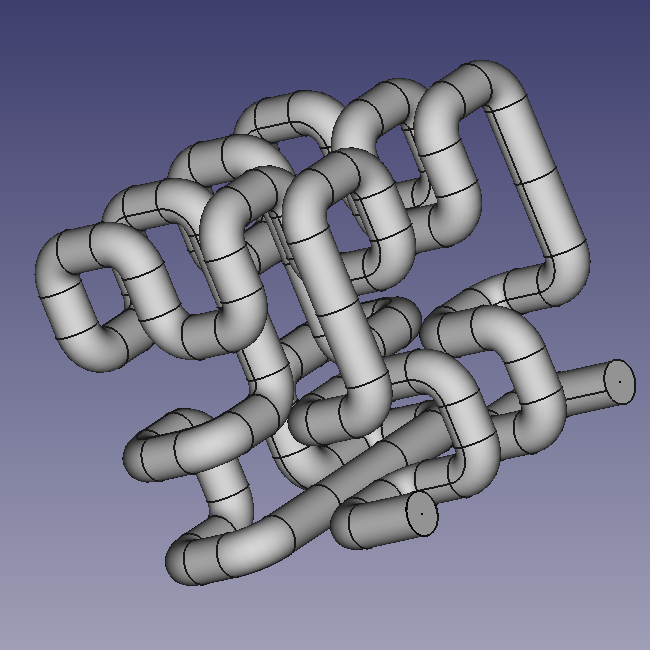

# Freecad-Macro-Hilbert-Curve
This is a FreeCad macro to create an Hilbert Curve fractal wire in 2 or 3 dimensions with many iterations.
The [Hilbert Curve](https://en.wikipedia.org/wiki/Hilbert_curve) is a fractal space filling curve.
By this macro you can create an Hilbert Curve wire in the Draft Workbench, and then use the wire
as a sweep path in the Part Workbench to create a solid.

## How to Use

In a FreeCad document start the macro. The dialog appears:

Select:

- The wire is two-dimensional or three-dimensional?

- The number of the iterations.

- The length of a segment.

Click OK to create the wire or CANCEL to exit the macro.

You can use the just created wire to do a sweep in the part Workbench.
But first of all it's better to apply a radius to the wire, or the sweep will be badly formed.
The size of the radius depends on the length chosen for the curve segments and on the shape of the profile you want to sweep. Maybe you need to take a few tries.

 

For example, create a circle in the Draft workbench:

and then go in the Part workbench and create a sweep of the circle with the path of the Hilbert Curve:

You did it!

Below there is an example in three dimensions:

## Acknowledgments

- The code was adapted to FreeCad starting from [galtay/hilbertcurve](https://github.com/galtay/hilbertcurve).

- It's written in [python](https://www.python.org).

- Something about the Hilbert Curve on [Wikipedia](https://en.wikipedia.org/wiki/Hilbert_curve).

- Tutorial for [scripting in FreeCad](https://wiki.freecadweb.org/Scripting_and_macros) on the FreeCad wiki.
